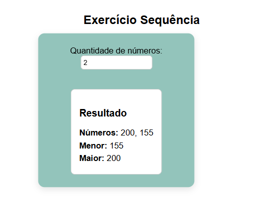
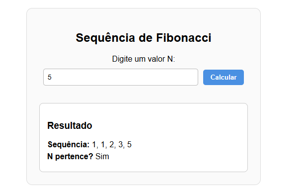
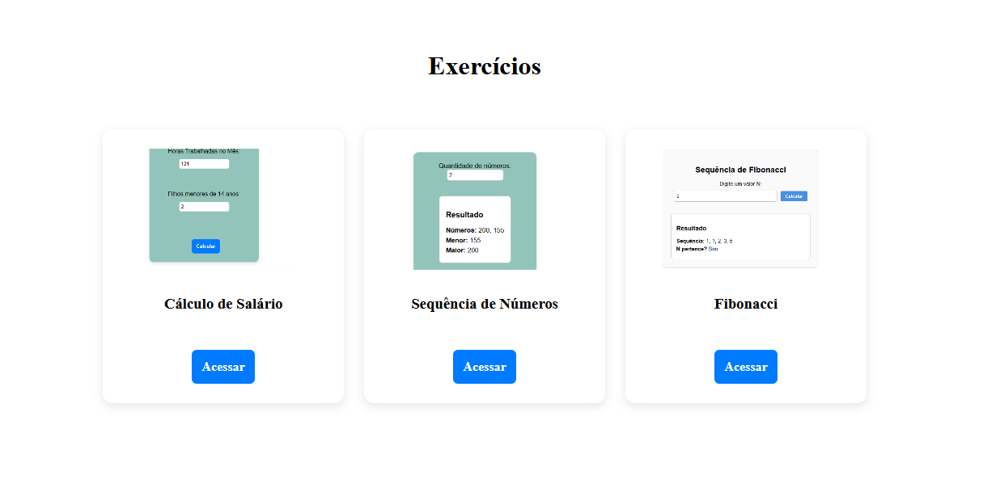

# 📝 Projeto – Testes ACEDATA (Estagiário)

Este repositório contém os **3 testes propostos** pela ACEDATA, além de uma **página Home** para navegação entre eles.

---

## 📌 **📂 Estrutura do Projeto**

* Frontend: React + Axios
* Backend: Java + Spring Boot
* API REST

A Home contém **3 cards**, cada um redirecionando para seu respectivo teste.

---

# 🚀 Testes

## ## 1️⃣ Teste – Cálculo de Salário

Desenvolvido conforme especificado, recebendo:

* Salário por hora
* Horas trabalhadas
* Quantidade de filhos menores de 14 anos

capaz de calcular:

* Salário Bruto
* Salário Família
* Salário Líquido

### **▶ Foto do Teste 1:**


---

## ## 2️⃣ Teste – Análise de Sequência Numérica

1 - Recebe do usuário um valor N, que representa a quantidade de números a serem digitados.

2 - Em seguida, recebe a sequência de N números.

3 - Ao final, o sistema exibe:

* A sequência digitada

* O menor número

* O maior número
### **▶ Foto do Teste 2:**



---

## ## 3️⃣ Teste – Sequência de Fibonacci

Recebe um valor N digitado pelo usuário.

Exibe:

Os N primeiros números da sequência de Fibonacci

Verifica se N faz parte da sequência (se N aparece como valor na lista).

### **▶ Foto do Teste 3:**



---

# 🏠 Página Home

A Home contém três cards com imagem, título e botão **ACESSAR**, redirecionando para cada exercício.

### **▶ Foto da Home:**



---

# 📦 Instalação e Execução

## Backend (Spring Boot)

```bash
mvn spring-boot:run
```

Executa em:

```
http://localhost:8080
```

## Frontend (React)

```bash
npm install
npm start
```

Executa em:

```
http://localhost:3000
```

---

# ✔ Status

* [x] Teste 1 finalizado
* [x] Teste 2 finalizado
* [x] Teste 3 finalizado
* [x] Página Home criada
* [x] Navegação funcionando

---

# 📚 Autor

Projeto desenvolvido por **Paulo Vilela** para o processo seletivo ACEDATA da vaga de Estagiario em Desenvolvimento.

---

